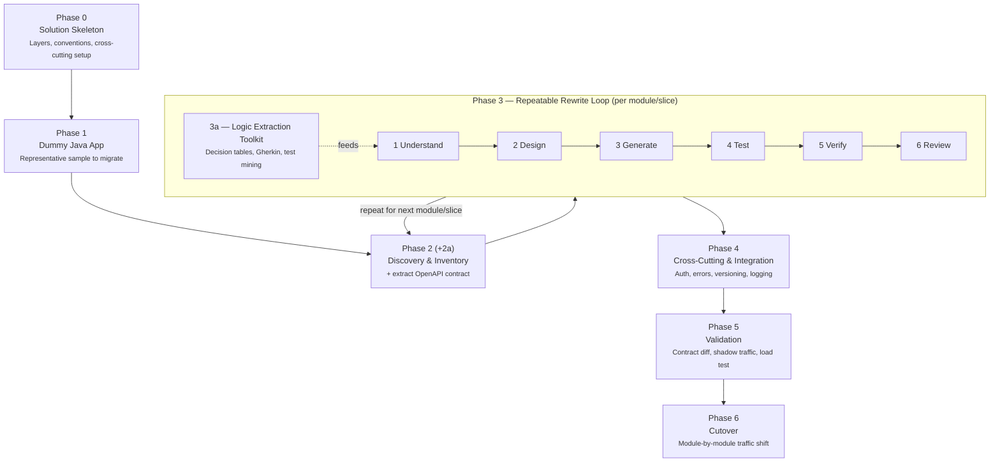
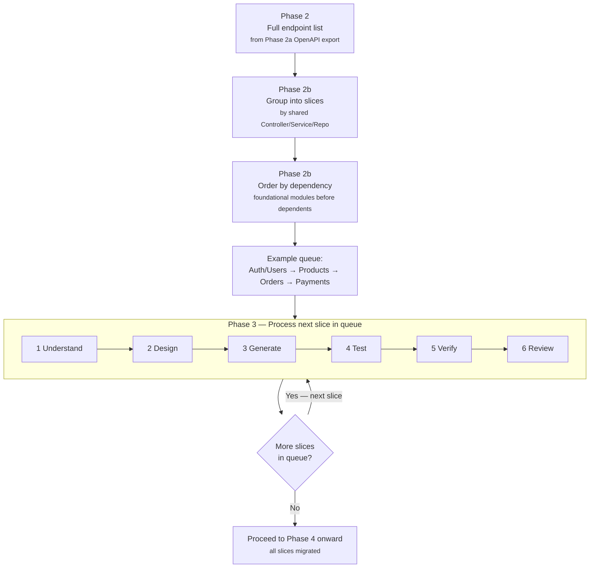

# Java → .NET Core API Migration Plan
**Role:** Senior .NET Architect view | **Scope:** Rewrite (not lift-and-shift) | **Method:** Claude-assisted, service-by-service | **Source:** Dummy Java app (no real codebase available yet)

---

## 1. Guiding Strategy

Because there's no live codebase yet, the plan is written to work against *any* dummy Java app you generate (Spring Boot is assumed as the typical case — call it out if yours is Jakarta EE/Micronaut/plain servlets instead, the mapping table below adjusts slightly).

Two strategic decisions up front:

**Rewrite pattern — Strangler Fig, not big-bang.** Migrate one bounded module/domain at a time (e.g., `UserService`, `OrderService`), stand it up in .NET Core behind the same API gateway/route prefix, and cut traffic over module by module. This is standard practice for backend rewrites because it keeps a working system at every step and limits blast radius. Even with a dummy app, structure the plan this way so it's directly reusable on the real one later.

**Unit of migration — the Java class/component, not the whole app.** You migrate one Controller → Service → Repository slice at a time, verify it, then move to the next. This maps naturally onto how you'll prompt Claude (below).

---

## 2. Architecture & Concept Mapping (Java → .NET Core)

| Java / Spring Boot | .NET Core Equivalent | Notes |
|---|---|---|
| `@RestController`, `@RequestMapping` | ASP.NET Core Controller (`[ApiController]`, `[Route]`) or Minimal API endpoint | Minimal APIs suit small services; Controllers suit larger, convention-heavy ones |
| `@Service` | Plain C# class registered via DI (`services.AddScoped<IFooService, FooService>()`) | No attribute needed; DI is constructor-based |
| `@Repository`, Spring Data JPA | EF Core `DbContext` + repository classes (or just EF Core directly) | Consider whether you even need a repository layer, or EF Core's `DbContext` is enough |
| `@Entity`, JPA annotations | EF Core entity classes + Fluent API / Data Annotations | Migrations via `dotnet ef migrations` |
| `application.yml` / `application.properties` | `appsettings.json` + `appsettings.{Environment}.json` | Strongly-typed via `IOptions<T>` |
| Spring Security + JWT | ASP.NET Core Identity / `Microsoft.AspNetCore.Authentication.JwtBearer` | Claims-based auth maps closely |
| Maven/Gradle | NuGet + MSBuild (`.csproj`) | |
| `@ExceptionHandler` / `@ControllerAdvice` | Custom `IExceptionFilter` or middleware (`app.UseExceptionHandler`) | |
| Spring AOP (logging, transactions) | Middleware, `DelegatingHandler`, or MediatR pipeline behaviors | |
| `@Transactional` | EF Core `DbContext` transactions / `IDbContextTransaction` | |
| Swagger via springdoc-openapi | Swashbuckle / `Microsoft.AspNetCore.OpenApi` | |
| JUnit + Mockito | xUnit/NUnit + Moq/NSubstitute | |
| Spring Boot Actuator | `Microsoft.Extensions.Diagnostics.HealthChecks` | |
| Kafka/RabbitMQ client (Spring) | MassTransit or native client SDKs | |

---

## 3. API Paradigm Decision (REST vs GraphQL vs gRPC)

Don't default to REST-for-REST — decide per module using these criteria, since the target platform doesn't need to mirror Java's shape 1:1:

- **REST (ASP.NET Core Web API / Minimal APIs):** default choice. Use for CRUD-style resources, public-facing APIs, anything consumed by third parties, or where the Java side is already REST and there's no reason to change the contract.
- **GraphQL (HotChocolate is the standard .NET library):** consider where the Java app exposes many overlapping REST endpoints to feed different frontend views (dashboard aggregation, mobile vs web needing different field subsets), or where over-/under-fetching is a known pain point today.
- **gRPC:** consider for internal service-to-service calls (not browser-facing) where you control both ends and want strong typing + performance — common if the Java app has internal microservice-to-microservice REST calls that could become gRPC.

Recommendation for this migration: **keep REST as the default for anything currently REST in Java**, and only introduce GraphQL/gRPC where you're deliberately fixing a known problem — don't add paradigm-switching risk on top of language-switching risk in the same pass. Revisit per-module during Phase 2 discovery below.

---

## 4. Step-by-Step Process

### Phase 0 — Set Up the .NET Solution Skeleton
1. Create the target solution structure once, up front, so every migrated module drops into the same shape:
   - `Api` (Controllers/Minimal API endpoints, DI wiring, `Program.cs`)
   - `Application` (services, business logic, DTOs, validators)
   - `Domain` (entities, enums, domain logic)
   - `Infrastructure` (EF Core `DbContext`, repositories, external clients)
   - `Tests` (unit + integration)
2. Pick and document conventions up front: layered vs Clean Architecture, Minimal APIs vs Controllers, EF Core vs Dapper, FluentValidation vs Data Annotations, MediatR (CQRS) or not. Write this as a short ADR (architecture decision record) so it's consistent across every migrated module — this matters a lot when Claude is generating code across many sessions, since consistent conventions are what make the output composable.
3. Stand up cross-cutting concerns once: global exception handling, logging (Serilog), auth/JWT validation, health checks, Swagger/OpenAPI, standard response envelope/error format.

### Phase 1 — Build/Obtain the Dummy Java App
Since there's no real codebase, generate a representative dummy Spring Boot app (Claude can do this) that mirrors the *shape* of complexity you expect from the real one: a handful of REST controllers, a service layer, JPA entities/repositories, DTOs, validation, a security filter, and one integration point (e.g., calling another service or sending an event). Keep it realistic enough that the migration steps below aren't trivial.

### Phase 2 — Discovery & Inventory (per module)
Before writing any C#, catalog what exists. For each Java module, produce an inventory: endpoints (verb, path, request/response shape), business rules embedded in the service layer, entity/DB schema, validation rules, security/authz rules, external calls, and error-handling behavior. This inventory becomes the acceptance spec for the .NET rewrite — it's what you check the new code against, not the Java source line-by-line.

**Phase 2a — Extract the machine-readable API contract first.** Before manually cataloging endpoints, wire up an OpenAPI generator on the Java side and pull the real contract instead of reading it off by hand:
- **Spring Boot:** add `springdoc-openapi` (`springdoc-openapi-starter-webmvc-ui`), run the app, and pull `/v3/api-docs` (JSON/YAML) plus browse `/swagger-ui.html`. It introspects `@RestController` classes at runtime, so it picks up every route, HTTP verb, request/response DTO shape, and status code without you tracing through the service layer by hand.
- **Older Spring apps:** check for `springfox-swagger2` instead (deprecated, but still common) — same idea, older annotation set.
- **Non-Spring Java (JAX-RS/Jersey):** use Eclipse MicroProfile OpenAPI or Swagger Core annotations (`io.swagger.core.v3`) directly on the resource classes.
- Save the generated `openapi.json` for each module alongside its behavior spec — it becomes the objective, diffable source of truth for "what the contract is," separate from the business-rule narrative you get from reading the service layer. Feed this spec to Claude alongside the Java source when generating the behavior spec in Phase 3, step 1 — it removes any ambiguity about exact routes, field names, and status codes.

**Phase 2b — Group into slices and sequence them.** The OpenAPI export gives a flat list of endpoints; group them by which Controller/Service/Repository they actually share before iterating in Phase 3, since related endpoints (e.g., GET/POST/PUT/DELETE on the same resource) are almost always one slice, not several — migrating them together avoids re-reading the same service class multiple times and keeps shared business rules handled consistently. Then order the slices by dependency, not by list order: foundational modules (auth, users, shared lookups) go first, so that when a dependent module (orders, payments) comes up later, what it calls already exists on the .NET side to build and test against.

### Phase 3 — The Repeatable Rewrite Loop (per Java class/module)
This is the core loop, run once per controller-service-repository slice:

1. **Understand** — Give Claude the Java file(s) for one slice and ask it to produce a plain-language behavior spec: inputs, outputs, validation, business rules, edge cases, error paths, side effects (DB writes, events published, external calls). Do not ask for code yet — ask for understanding, and review/correct this spec yourself before moving on. This is the highest-leverage step; errors here propagate into the rewrite.
2. **Design** — Decide the .NET shape for this slice against the Phase 0 conventions: DTOs, endpoint route, service interface, EF Core entity changes.
3. **Generate** — Ask Claude to implement the .NET Core equivalent from the *behavior spec* (not a literal line-by-line port), following the established solution conventions.
4. **Test** — Ask Claude to generate unit tests from the same behavior spec (including edge cases identified in step 1), independent of the implementation, so tests validate against the spec rather than rubber-stamping whatever the generated code does.
5. **Verify** — Run the tests; for extra confidence, run both Java and .NET versions side by side against the same inputs (a small script or Postman/Insomnia collection) and diff the responses.
6. **Review** — Human review pass on generated code: naming, error handling, security (authz checks preserved?), performance (N+1 queries from EF Core is a common regression point coming from JPA).
7. Move to the next slice.

### Phase 3a — Deep-Dive Toolkit for Extracting & Documenting Business Logic

Phase 3 step 1 ("Understand") is the highest-leverage step in the whole migration, so it's worth a dedicated toolkit rather than just reading files top to bottom. Business logic in a Java app hides in more places than the service layer, and the goal here is a documentation artifact structured enough that it can be fed straight into Claude as the spec for the .NET rewrite in Phase 3 step 3.

**Find logic in the places it's easy to miss.** The service layer is the obvious spot, but also check: entity getters/setters that do more than return a field, static utility/helper classes, `@ControllerAdvice` exception handlers (business meaning is often encoded in *which* exception maps to *which* response), custom Bean Validation annotations, AOP aspects (logging/transactions can carry hidden side effects), configuration-driven behavior in `application.yml` (feature flags, thresholds), and database triggers/stored procedures — code reading alone won't surface DB-level logic, so check the schema and any Flyway/Liquibase migration history directly.

**Mine the existing test suite before writing new documentation.** Existing JUnit tests are frequently the most reliable behavior spec that already exists, since test names and assertions state expected behavior explicitly, including edge cases someone already thought to cover. Read these before reading the implementation — they tell you *what* the code is supposed to do; the implementation just tells you what it currently does (which may include unintentional bugs you don't want to carry forward). A JaCoCo coverage report also flags which code paths have *no* test coverage — those are the highest-risk areas during migration since there's no safety net confirming current behavior.

**Capture real behavior, not just read code.** Where possible, pull real request/response pairs from access logs, an API gateway, or a proxy capture while the Java app is running (or exercised in a lower environment). This becomes a golden dataset you can replay against the new .NET service in Phase 5 validation — much stronger than eyeballing whether the rewrite "looks right."

**Use structured formats instead of free-form prose for business rules** — these translate far more reliably into both human review and Claude-generated code/tests than a paragraph description:
- **Decision tables** for conditional/branching logic (pricing rules, eligibility checks, validation chains) — rows of condition combinations to outcomes.
- **Given/When/Then (Gherkin)** scenarios per business rule — doubles as living documentation and can be turned directly into executable acceptance tests on the .NET side via Reqnroll/SpecFlow, closing the loop between spec and test.
- **State/lifecycle diagrams** for any entity with a status field (Order, Payment, Ticket, etc.) — these almost always hide transition rules ("can only cancel if status is PENDING") that are easy to miss reading service methods in isolation.
- **Sequence diagrams** for any flow spanning multiple classes/services — clarifies transaction boundaries, what's synchronous vs. async, and where side effects (events, external calls) actually fire.

**Use tooling to map structure before reading line by line.** SonarQube (or a free complexity check) flags high-cyclomatic-complexity methods worth extra scrutiny; IDE call-hierarchy/structure views (or `jdeps`) show what actually calls what, which matters because business logic in Java frequently spans Controller → Service → Repository → Entity, so reading one class in isolation misses context. Feed Claude the whole slice together for the same reason, not one file at a time.

**Check history for the "why," not just the "what."** Git blame, commit messages, and PR descriptions often reference the ticket or compliance reason a rule exists — that context doesn't live in the code and is easy to lose in a rewrite ("why does this reject orders over $10,000 on Tuesdays" is usually answerable from history, not from the `if` statement alone).

**Standardize the output per module** so every migrated slice produces comparable documentation, and so it's a consistent, predictable input to Claude each time:
1. Purpose/responsibility (one paragraph)
2. Endpoints — from the Phase 2a OpenAPI export (routes, verbs, request/response shapes, status codes)
3. Business rules — as decision tables and/or Given/When/Then scenarios
4. Entity state/lifecycle diagram (if applicable)
5. Dependencies — internal services called, external APIs, DB tables touched
6. Error handling & edge cases
7. Non-functional notes — auth requirements, known perf issues, rate limits

Store these as versioned markdown (or `.feature` files for the Gherkin scenarios) alongside the code, one file per module — this becomes both the spec Claude generates the .NET implementation from, and the living documentation that outlives the migration itself.

### Phase 4 — Cross-Cutting & Integration
Once individual slices are migrated, wire up what spans them: shared auth, consistent error envelope, API versioning, rate limiting, logging/correlation IDs, and any inter-service calls. Re-test integration points specifically, since these are where per-slice migration is most likely to silently diverge from the original.

### Phase 5 — Validation Strategy
- Contract tests against the documented API shape: diff the springdoc-openapi spec captured in Phase 2a against the Swashbuckle-generated spec from the new .NET service (routes, verbs, field names/types, status codes) to catch drift objectively instead of relying on manual comparison.
- Parallel/shadow run where feasible: route a copy of real traffic to both Java and .NET, compare responses, before cutting over.
- Load/perf baseline comparison — EF Core and JPA have different default behaviors (lazy loading, query generation); don't assume perf parity without measuring.

### Phase 6 — Cutover
Module-by-module traffic shift at the gateway/reverse-proxy level (percentage-based or by route), not a single flip for the whole app. Keep the Java module reachable as a fallback until the .NET replacement has run clean in production for an agreed soak period.

---

## 5. Worked Example (Dummy Slice)

To make this concrete, here's the pattern applied to a single typical slice — happy to actually generate this dummy Java class and its .NET rewrite next if useful:

- **Java side:** `ProductController` (GET/POST `/api/products`) → `ProductService` (validation + stock-check business rule) → `ProductRepository` (Spring Data JPA) → `Product` entity.
- **Step 1 output (behavior spec):** "GET /api/products/{id} returns 404 if not found, 200 with ProductDto otherwise. POST /api/products validates name (required, max 100 chars) and price (> 0), rejects duplicate SKU with 409, persists via repository, publishes `ProductCreatedEvent`."
- **Step 3 output:** ASP.NET Core `ProductsController` (or minimal API group), `IProductService`/`ProductService`, EF Core `Product` entity + `AppDbContext`, FluentValidation validator, same status codes.
- **Step 4 output:** xUnit tests covering not-found, duplicate SKU, and the validation edge cases from the spec.

---

## 6. Claude Usage Playbook

Since Claude is the execution engine for this migration, treat each Phase-3 step as a distinct prompt, not one mega-prompt:

- Keep "understand" and "generate" as separate turns — reviewing the behavior spec before code exists is what catches misread business logic early, when it's cheap to fix.
- Paste the actual Java source for the slice being migrated each time, plus the Phase 0 ADR/conventions doc, so output stays consistent across sessions/slices.
- Ask explicitly for edge cases and error paths in the behavior spec — these are the most common thing lost in a rewrite.
- For tests, prompt from the spec, not from "write tests for this code," to avoid tests that just mirror bugs in the generated implementation.
- Periodically ask Claude to review a batch of already-migrated slices together for consistency (naming, error format, DTO conventions) — drift creeps in across long sessions.

---

## 7. Risks & Mitigations

Common failure modes in Java→.NET rewrites, worth watching for explicitly: silently dropped business rules embedded deep in Java service methods (mitigated by the spec-first step), N+1 query regressions from EF Core defaults differing from JPA, authz rules re-implemented incorrectly (test authz paths explicitly, not just happy paths), and validation rule mismatches (e.g., Bean Validation vs FluentValidation edge-case differences like empty-string vs null handling).

---

## 8. Beyond a 1:1 Port — Performance, Security, Scalability, Maintainability

A rewrite is the one chance to fix things a straight port would carry over unchanged. These are concrete .NET Core choices worth deciding on now, in Phase 0, rather than discovering the need mid-migration.

### Performance
- **Minimal APIs** for high-throughput/simple endpoints — materially less per-request overhead than MVC controllers; use Controllers where you need the structure (filters, conventions) instead.
- **`System.Text.Json`** (default) over Newtonsoft.Json — faster and lower-allocation; only pull in Newtonsoft if a specific serialization quirk from the Java side requires it.
- **EF Core query discipline**: `AsNoTracking()` for read-only queries, project to DTOs instead of loading full entity graphs, and watch for N+1s explicitly — this is the single most common performance regression teams hit coming from JPA, since EF Core's lazy-loading defaults differ.
- **Output/response caching** (`Microsoft.AspNetCore.OutputCaching`) and a distributed cache (Redis) for shared state across instances — same role as Ehcache/Caffeine/Redis on the Java side.
- **gRPC for internal service-to-service calls** where both ends are under your control — protobuf beats JSON-over-REST on latency and payload size for high-volume internal traffic.
- **Native AOT** (.NET 8+) if these are containerized and startup time/memory footprint matter (e.g., scale-to-zero, fast pod restarts) — no direct JVM equivalent; this is a genuine advantage over the Java baseline.
- Benchmark with the **same load-testing tool against both stacks** (k6 or JMeter) so performance comparisons are apples-to-apples, not vibes.

### Security
- **OWASP parity pass**: walk the OWASP Top 10 against what Spring Security currently enforces (CORS policy, CSRF handling, security headers) and confirm each is explicitly configured in ASP.NET Core — nothing carries over automatically just because the framework changed.
- **Secrets management**: move off anything hardcoded/`application.yml`-embedded into a proper secrets store (Azure Key Vault, AWS Secrets Manager, or HashiCorp Vault) — don't let secrets handling regress during the rewrite.
- **Built-in NuGet vulnerability audit** (`dotnet list package --vulnerable`, or NuGet Audit in .NET 8 SDK) as the equivalent of the OWASP Dependency-Check Maven plugin — wire it into CI from day one.
- **FluentValidation everywhere input crosses a trust boundary** — consistent validation is also your first line of defense against injection-style bugs.
- **mTLS or at least network-policy isolation** for internal service-to-service calls if the target is a multi-service/microservices layout, not just perimeter auth.
- **Security headers middleware** (HSTS, CSP, X-Frame-Options) — easy to forget since Spring Security sets some of these by convention; ASP.NET Core does not.

### Scalability
- **Stateless services by design** — externalize session/state to Redis (or equivalent) so any instance can serve any request; this is what actually makes horizontal scaling and the strangler-fig traffic-shifting in Phase 6 work cleanly.
- **Resilience via Polly** (retry, circuit breaker, timeout, bulkhead policies) wrapping outbound calls — the .NET equivalent of Resilience4j; add this now rather than bolting it on after the first cascading failure.
- **Event-driven decoupling** for anything that doesn't need a synchronous response — MassTransit over Kafka/RabbitMQ/Azure Service Bus, matching whatever async messaging pattern (if any) already exists in the Java app, or introducing it where synchronous call chains are currently a scaling bottleneck.
- **CQRS + read replicas** (MediatR for the in-process pattern) for specifically read-heavy modules identified during Phase 2 discovery — don't apply this everywhere, only where the access pattern justifies it.
- Container-native from the start: Docker + Kubernetes (or whatever the Java app already runs on) with health checks wired to k8s liveness/readiness probes, and autoscaling rules tied to real metrics (CPU, queue depth), not guesses.

### Maintainability
- **Nullable reference types enabled** (`<Nullable>enable</Nullable>`) — compile-time null-safety that Java doesn't have natively; turning this on early prevents a large class of runtime NullReferenceExceptions the Java version may currently tolerate at runtime.
- **Roslyn analyzers + `.editorconfig`** enforced in CI, as the equivalent of Checkstyle/SpotBugs/PMD on the Java side — keep code style and common-bug detection automated, not review-dependent.
- **OpenTelemetry** for logging, metrics, and distributed tracing — vendor-neutral and usable on both the Java and .NET side simultaneously, which is genuinely useful *during* the migration: you can trace a request across old and new services in the same view while modules are being cut over.
- **API versioning from the first release** (`Asp.Versioning.Http`) so later modules can evolve without breaking already-migrated consumers.
- **Feature flags** for the cutover itself (even a simple config-based flag), giving you a faster rollback lever than a full gateway re-route if a freshly migrated module misbehaves in production.
- Treat the **Phase 2a OpenAPI spec as living documentation**, not a one-time export — regenerate and diff it on every change so the contract and the code can't silently drift apart.

---

## Suggested Next Step

Generate the dummy Java app (or a first realistic module of it) and run it through Phases 2–3 once, end to end, as a template — that gives a concrete, reusable pattern before scaling to the rest of the "app."
